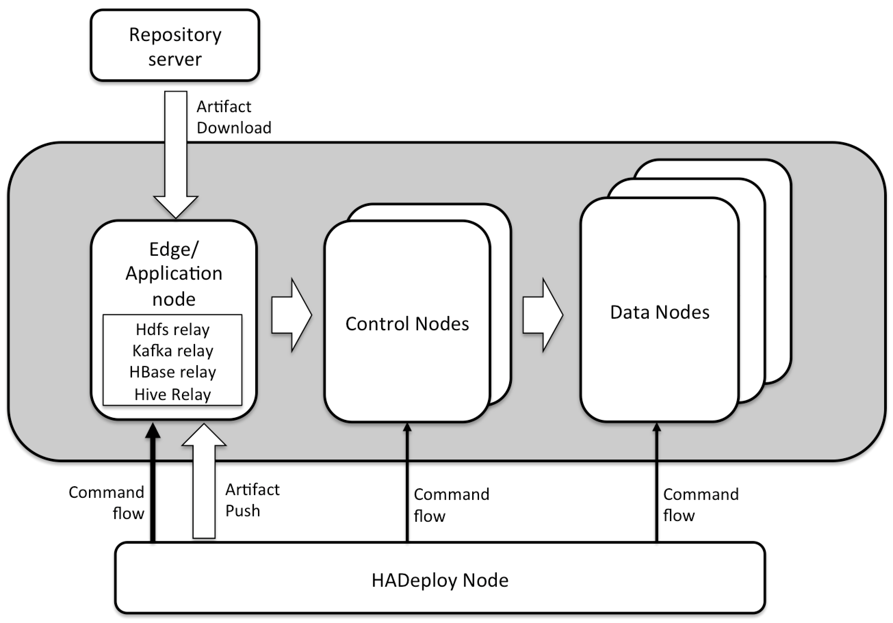

# HADeploy

## Overview

An Hadoop application is composed of many independent components and resources:

* Scripts or programs (Hive, MapReduce, Spark, Pig,…)
* HDFS Layout
* Hive table (Hive Metastore definition).
* HBase table.
* Kafka topics,
* Initial data sets.
* …

Current deployment tools does not provide plugins for Hadoop components. And each component has its own configuration and authorization  system, designed and implemented independently.

HADeploy is designed to resolve these issues. Thus allowing Continuous Integration and Continuous Deployment practices in the Hadoop world.

## How it works

HADeploy is installed on a specific node, out of the cluster perimeter. It could be a user’s Linux workstation.

Of course, a single HADeploy installation can address several clusters.

From this node, HADeploy will issue appropriate commands to be executed on the different nodes of the target cluster.

It will also push application artifact, or trigger artifact fetching from any repository server (Nexus, Artifactory, Jenkins, or a simple Http server).

### Relaying

Issuing some commands to specifics subsystem, such as HDFS require a quite complex client configuration.

To avoid this, HADeploy will not issue such command directly, but push the command on one of the cluster node, called ’Relay node'.

An edge node of the cluster typically assumes this function.

## Base principles

### Application manifest

An application can be fully described in one file, hosting all components and resources description.

### Infrastructure independency

Application file is independent of target physical infrastructure. This target is defined in another file and HADeploy will take care of the merge on deployment

### Environment independency.

In the same way, the application file is independent of the environment (DEV, INT, PPRD, PROD,..). This ensure coherency and repeatable deployments among these contexts

### Declarative programming and reconciliation

HADeploy is a purely descriptive tool. As such usage will consist of defining the expected state of the deployed application and let the tool perform the reconciliation between expected and actual state.

### Idempotence

Such principle means HADeploy is a fully idempotent tools, as if expected state match the actual ones, the tool will not perform any further actions.

### Application instance isolation.

A typical deployment pattern allowed by HADeploy is to define ‘Application Container’, or ‘Application Lane’. Then several instance (or version) of an application can be installed and run in parallel.

### Kerberos support

HADeploy is able to deploy application on a Hadoop cluster secured by Kerberos. 

### Rights management

HADeploy will manage all permissions associated to the deployed components and resources.

### Plugins architecture

HADeploy is designed with a higly modular plugin architecture, thus allowing easy third party extension.

### Application Removal

As HADeploy knows about all the components of your application, it provides a REMOVAL mode, which restores the target cluster in its initial state.

### Open Source

HADeploy is a fully open source project, under GNU General Public License. [Hosted on Github](https://github.com/BROADSoftware/hadeploy).
