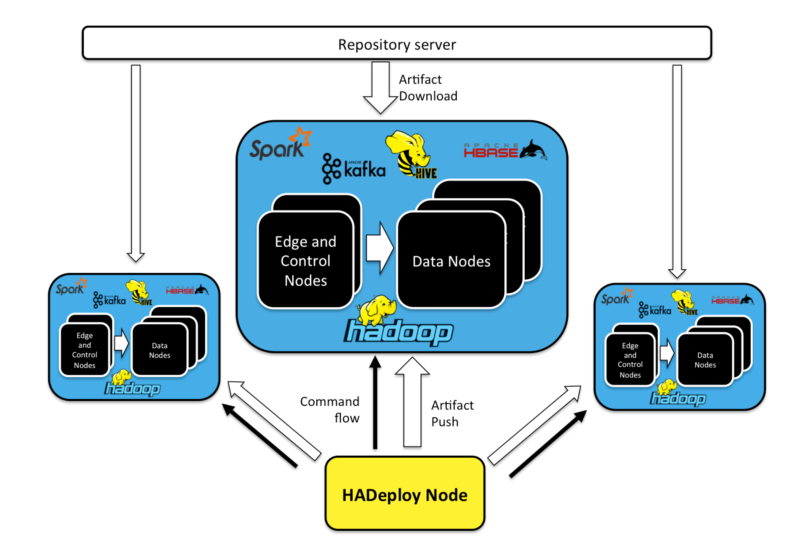

# HADeploy

## Overview

An Hadoop application is composed of many independent components and resources:

* Scripts or programs (Hive, MapReduce, Spark, Pig,…)
* HDFS Layout
* Hive table (Hive Metastore definition).
* HBase table.
* Kafka topics,
* Initial data sets.
* …

Current deployment tools do not provide plugins for Hadoop components. And each component has its own configuration and authorization  system, designed and implemented independently.

HADeploy is designed to solve these issues. Thus facilitating the adoption of Continuous Integration and Continuous Deployment practices in the Hadoop world.

## How it works

HADeploy can be installed on an dedicated node, or on a user’s workstation.
From this node, it will issue appropriate commands to be executed on the different nodes of the target cluster.

It will also push application artifact, or trigger artifact fetching from any repository server (Nexus, Artifactory, Jenkins, or a simple Http server).

A single HADeploy installation can deal with multiple clusters.

## Base principles

### Application manifest

An application can be fully described in a single file, along with all their required components and resources.

### Infrastructure agnostic

The Application Manifest model is agnostic to the target physical infrastructure. 
The target cluster is defined in a separate file that will be accessed at deployment time, and that can be used for all application deployments on this cluster.

### Environment agnostic.

HADeploy can also take as input an environment description file that encourages re-use, consistency and repeatable deployments in different execution contexts 
(e.g. Development vs Production environments…)

### Idempotence

HADeploy embeds the lightweight Ansible tool as its main execution engine. By doing so, it benefits from the idempotency principles at the core of Ansible design.
As with Ansible, you will be able to run the same application deployment multiple times and expect the same result. If the application is in the expected state on the target cluster, 
then HADeploy will not perform any actions, but simply display that it is satisfied with the current state.

### Target State vs Programming

HADeploy is a purely descriptive tool. No programming is required. Admins define the expected state of the application and let the tool perform 
the reconciliation between expected and actual state.

### Application instance isolation.

A typical deployment pattern allowed by HADeploy is to define ‘Application Container’, or ‘Application Lane’. Then several instances (or versions) of an application can be installed and run in parallel.

### Kerberos support

HADeploy is Kerberos friendly and will happily deploy applications on your secured cluster. 

### Privilege management

HADeploy will manage all permissions associated to the deployed components and resources

### Plugins architecture

HADeploy is designed with a modular plugin architecture, thus allowing easy third party extension.

### Application Removal

Since HADeploy knows about all the components of your application, it provides a REMOVAL mode that will restore the target cluster in its initial state. 

### Open Source

HADeploy is a fully open source project, under GNU General Public License. [Hosted on Github](https://github.com/BROADSoftware/hadeploy).
