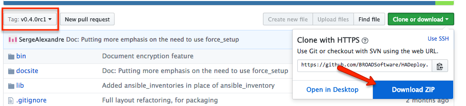

# Installation

## Version

The lastest stable version of HADeploy is **`0.5.6`**.

## Prerequisite

HADeploy can be installed on a Linux system, or on a MAC OS X workstation

*Installation on Windows is not supported, but VirtualBox and Vagrant would be your best friends in this case.*

### Ansible

HADeploy internally use [Ansible](http://docs.ansible.com/ansible/). If it is not already installed, you can install it independantly, or let HADeploy install it automatically.

NB: HADeploy require at least **Ansible version 2.3.0** 

### Virtual environnement
 
HADeploy (And Ansible) can be installed inside Python [virtual Environnemnt](https://virtualenv.pypa.io/en/stable/).

Installing inside virtual environement has several advantages:

* Installation does not require root access.

* You can have several isolated version installed on the same system.

* Your installation will not interfere with others users. 

One drawback is you will need to activate your virtual environnement on each login. But you can automate this in your `~/.profile`.
 
Of course, if you want to share a single installation of HADeploy amongst all users of your system, you must install it globally.

## Latest release via `pip` (Linux)

Current installation process has been tested on RHEL/CentOS7 (Python 2.7). Installation on other Linux Variant may works. All feedbacks are welcome.

`pip` is the Python package manager. If not already installed, you can easely install it. For example, on RHEL/CentOS7:

```bash
sudo yum install -y python-pip
```

If Ansible is not already installed, you must ensure several required package are present. For example, on RHEL/CentOS7:

```bash
sudo yum install -y python-devel openssl-devel gcc
```

We strongly adivise you to ensure you have the latest `pip` version:

```bash
sudo pip install --upgrade pip
```

Then, you can install HADeploy:

```bash
sudo pip install HADeploy
```
Or simply 
```bash
pip install HADeploy
```
If you are in a virtual environment

> If you encounter any trouble during these last steps, again, be sure you have the latest pip version, as stated above. 

You are now ready to used HADeploy from this workstation.

## Latest release via `pip` (Mac OS X)

`pip` is the Python package manager. If not already installed, you can easely install it. 

```bash
sudo easy_install pip
```

Then, you can install HADeploy:

```bash
sudo pip install HADeploy
```
Or simply 
```bash
pip install HADeploy
```
If you are in a virtual environment

You are now ready to used HADeploy from this workstation.

> Do NOT use `easy_install` to install HADeploy directly.

## Install from source GIT repository.

HADeploy is easy to install directly from source. If you want to have the very latest versions, or a specific one, or intend to contribute, this is the method of choice.
 
For Linux only, install several required package:

```bash
sudo yum install -y git python-pip python-devel openssl-devel
```
Then clone the HADeploy git repository:

```bash
git clone https://github.com/BROADSoftware/hadeploy.git
```

Move to the newly create directory: 

```bash
cd hadeploy
```

If you need, switch on a specific version.

```bash
git checkout v0.X.X
```

(Use `git tag` to have a list of all versions)

And perform required python module installation using pip:

```bash
sudo pip install -r requirements.txt
```
or simply

```bash
pip install -r requirements.txt
```
If you are in a virtual environment

To perform some Hive, Kafka and HBase configuration, HADeploy will use some specific modules. These need to be downloaded to complete the installation. For this:

```bash
chmod +x lib/hadeploy/plugins/setup.sh
./lib/hadeploy/plugins/setup.sh
```

And, last but not least, add HADeploy to your path:

```bash
cd ../bin
export PATH=$PATH:$(pwd)
# or
export PATH=$PATH:<whereHADeployWasCloned>/hadeploy/bin
```

You are now ready to used HADeploy from this workstation.

### Using ZIP archive

If, for any reason, you are unable to clone from Github, you can download the source code:



Before downloading, you may take care of selecting the appropriate version (`Tag:`, on the left).

All other installation steps described above remains unchanged.

## No direct Internet access ?

If the computer on which you want to install HADeploy can access Internet using a proxy, you can configure `pip` to use it. If this is not possible, here is an alternate method:

These instructions are for RHEL/CentOS7. They could be adapted for other environment.

It is assumed the computer has access to a local yum package repository, including EPEL. 

It is also assumed you have an Internet access from another system, and be able to copy files from this system to the isolated target.

First, install `Ansible` and `pip` using yum:

```bash
sudo yum install -y ansible python-pip
```
Then, you will need to download a set of python packages from another (connected) computer: 

* Download the latest `HADeploy` 'wheel' package (.whl file) from the [pypi site](https://pypi.python.org/pypi/HADeploy) 
* Download the latest `pykwalify` 'wheel' package (.whl file) from the [pypi site](https://pypi.python.org/pypi/pykwalify)
* Download the latest `docopt package` (.tar.gz file) from the [pypi site](https://pypi.python.org/pypi/docopt)
* Download the latest `PyYAML package` (.tar.gz file) from the [pypi site](https://pypi.python.org/pypi/PyYAML)
* Download the latest `python-dateutil` 'wheel' package (.whl file) from the [pypi site](https://pypi.python.org/pypi/python-dateutil)

* Copy all these this package files to the target system, for example in `/tmp`.

* Install the packages in this order:
```bash
sudo pip install /tmp/python_dateutil-X.Y.Z-py2.py3-none-any.whl
sudo pip install /tmp/PyYAML-X.YZ.tar.gz
sudo pip install /tmp/docopt-X.Y.Z.tar.gz
sudo pip install /tmp/pykwalify-X.Y.Z-py2.py3-none-any.whl
sudo pip install /tmp/HADeploy-X.Y.Z-py2-none-any.whl
```
Adjust the version number for the downloaded one. And remove the sudo if you install in a virtual environment.

You should be now ready to used HADeploy from this workstation.

Note this procedure reflect the package dependencies at the time of this writing. This can evolve, but, applying the same principle, you should be able to adjust.


